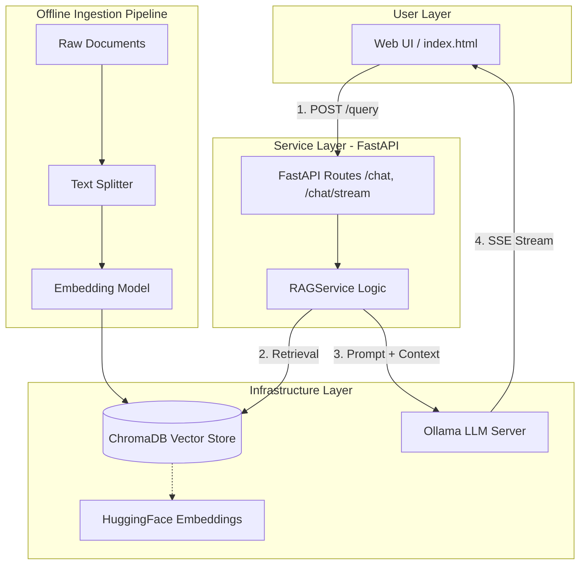

```mermaid
graph TD
    subgraph Client_Layer [User Layer]
        UI[Web UI / index.html]
    end

    subgraph API_Layer [Service Layer - FastAPI]
        API[FastAPI Routes /chat, /chat/stream]
        RAG[RAGService Logic]
    end

    subgraph Data_Layer [Infrastructure Layer]
        DB[(ChromaDB Vector Store)]
        LLM[Ollama LLM Server]
        Embed[HuggingFace Embeddings]
    end

    subgraph Ingestion_Flow [Offline Ingestion Pipeline]
        Docs[Raw Documents] --> Split[Text Splitter]
        Split --> EmbedIngest[Embedding Model]
        EmbedIngest --> DB
    end

    %% Request Flow
    UI -- "1. POST /query" --> API
    API --> RAG
    RAG -- "2. Retrieval" --> DB
    DB -.-> Embed
    RAG -- "3. Prompt + Context" --> LLM
    LLM -- "4. SSE Stream" --> UI
```